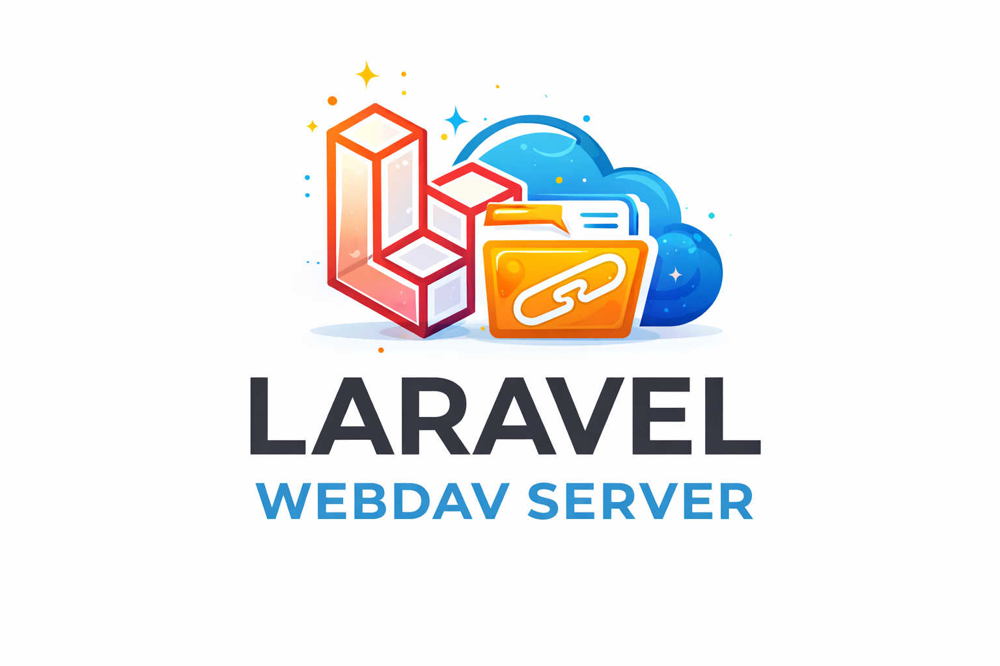

# Laravel WebDAV Server

A WebDAV server for Laravel powered by [SabreDAV](https://sabre.io/dav/), exposing any configured
Flysystem disk through the WebDAV protocol.

[](https://packagist.org/packages/n3xt0r/laravel-webdav-server)
[](https://github.com/N3XT0R/laravel-webdav-server/actions)
[](https://qlty.sh/gh/N3XT0R/projects/laravel-webdav-server)
[](https://qlty.sh/gh/N3XT0R/projects/laravel-webdav-server)
[](https://packagist.org/packages/n3xt0r/laravel-webdav-server)

---

> [!WARNING]
> This package is currently under active development and not yet production-ready.
> APIs, configuration keys, and behaviour may change without notice between releases.
> Use in production at your own risk.

---



## Overview

Laravel WebDAV Server provides a native WebDAV server implementation for Laravel applications, built on top of SabreDAV.

The primary goal of this package is to bridge the gap between:

- the **WebDAV protocol** (via SabreDAV)
- and **Laravel's filesystem abstraction** (Flysystem)

Instead of working with local filesystem paths directly, this package maps WebDAV nodes to Laravel disks, making it
possible to expose any configured storage (local, S3, etc.) through a WebDAV interface.

## Features

- WebDAV server powered by SabreDAV
- Native integration with Laravel filesystem disks
- User-based storage mapping via pluggable resolvers
- Pluggable authentication layer (no coupling to Laravel auth)
- Clean separation between transport (WebDAV) and domain logic
- Fully extensible architecture (custom storage, auth, authorization)

---

## Requirements

- PHP **8.4+**
- Laravel **12+**

---

## Installation

```bash
composer require n3xt0r/laravel-webdav-server
php artisan vendor:publish --tag="laravel-webdav-server-config"
php artisan migrate
```

---

## Architecture

→ [docs/architecture.md](docs/architecture.md)

---

## Configuration

```php
// config/webdav-server.php  –  accessed at runtime as webdav.*
return [
    'base_uri' => '/webdav/',

    'storage' => [
        'disk'   => 'local',   // any disk from config/filesystems.php
        'prefix' => 'webdav',  // each user's root: {prefix}/{principal_id}
    ],

    'auth' => [
        'model'               => null,  // required: App\Models\WebDavAccount::class
        'username_column'     => 'username',
        'password_column'     => 'password_encrypted',
        'enabled_column'      => 'enabled',  // set to '' to skip the check
        'user_id_column'      => 'user_id',
        'display_name_column' => 'username',
    ],
];
```

---

## Route

```php
Route::any('/webdav/{path?}', \N3XT0R\LaravelWebdavServer\Http\Controllers\WebDavController::class)
    ->where('path', '.*');
```

---

## Extension Points

All default bindings use `bindIf()` – bind your own implementation in `AppServiceProvider::register()` and it takes
precedence automatically.

| Contract | Default | Override to… |
|---|---|---|
| `CredentialValidatorInterface` | `DatabaseCredentialValidator` | Custom auth (LDAP, tokens, …) |
| `WebDavAccountRepositoryInterface` | `EloquentWebDavAccountRepository` | Non-Eloquent user stores |
| `SpaceResolverInterface` | `DefaultSpaceResolver` | Per-user disk / path routing |
| `PathAuthorizationInterface` | `GatePathAuthorization` | Replace Gate with ACL, RBAC, … |

**Default storage mapping:** `webdav.storage.prefix/{principal.id}` on `webdav.storage.disk`.

---

## Authorization / Policies

The default `GatePathAuthorization` calls `Gate::forUser($principal->user)->inspect($ability, $resource)` before every
filesystem operation. The resource passed to the policy is always `WebDavPathResourceDto` with two public properties:
`disk` and `path`.

**The five policy abilities:**

| Ability | When |
|---|---|
| `read` | PROPFIND, GET, file metadata |
| `write` | PUT (overwrite) |
| `delete` | DELETE (recursively checked on every node) |
| `createDirectory` | MKCOL |
| `createFile` | PUT (new file) |

> The service provider auto-registers `App\Policies\WebDavPathPolicy` – **you must create this class** in your
> application. A ready-to-use reference implementation is shipped in [`src/Policies/WebDavPathPolicy.php`](src/Policies/WebDavPathPolicy.php).

To use a different policy class:

```php
// AppServiceProvider::boot()
Gate::policy(
    \N3XT0R\LaravelWebdavServer\DTO\Auth\WebDavPathResourceDto::class,
    \App\Policies\MyCustomPolicy::class,
);
```

To bypass Gate entirely, bind your own `PathAuthorizationInterface` implementation.
Throw `Sabre\DAV\Exception\Forbidden` on denial – never a Laravel HTTP exception.

---

## Supported WebDAV Operations

`PROPFIND` · `GET` · `PUT` · `DELETE` · `MKCOL`

---

## Developer Commands

```bash
composer run test       # Pest test suite (random order)
composer run lint       # auto-fix code style (Laravel Pint)
composer run test:lint  # dry-run style check
composer run serve      # workbench app → http://0.0.0.0:8000
```

---

## License

The MIT License (MIT). See [LICENSE.md](LICENSE.md) for details.
