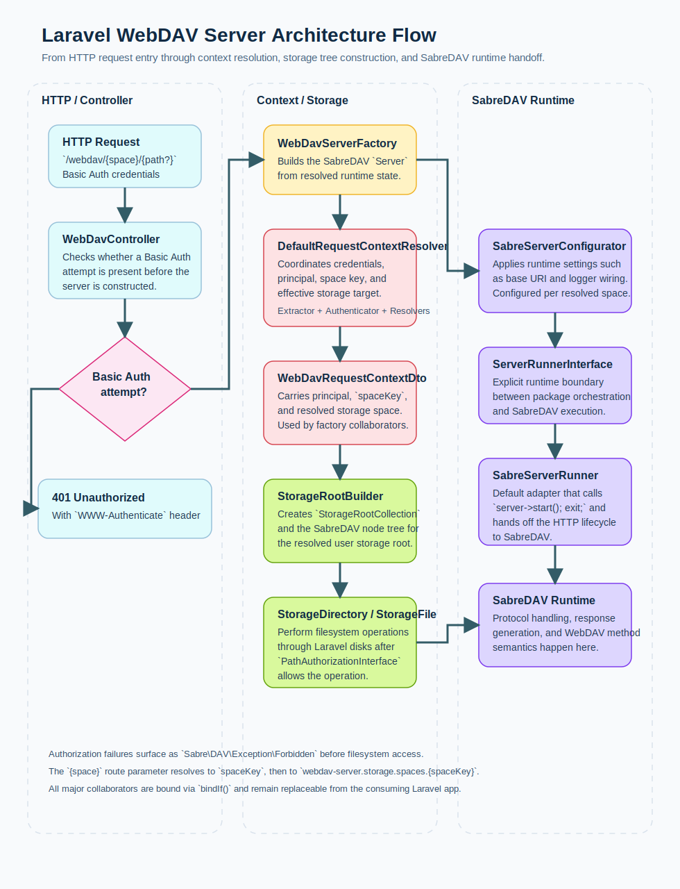

# Architecture

Every WebDAV request passes through this runtime flow:

1. `WebDavController::__invoke()` accepts the incoming request for `/webdav/{space}/{path?}`.
2. If no Basic Auth attempt is present, the controller returns `401 Unauthorized` with `WWW-Authenticate`.
3. If credentials are present, `WebDavServerFactory::make(request)` builds the SabreDAV server instance.
4. `DefaultRequestContextResolver::resolve(request)` gathers the runtime context:
   - `RequestBasicCredentialsExtractor::extract(request)` parses credentials
   - `ValidatorPrincipalAuthenticator::authenticate(username, password)` resolves the principal through
     `CredentialValidatorInterface`
   - `RequestSpaceKeyResolver::resolve(request)` resolves `{space}` or falls back to
     `config('webdav-server.storage.default_space')`
   - `SpaceResolverInterface::resolve(principal, spaceKey)` resolves the effective storage target as a
     `WebDavStorageSpaceValueObject`
   - the gathered runtime DTO is `RequestContextDto`
5. `StorageRootBuilder::build(principal, space)` creates the SabreDAV root tree:
   - `StorageRootCollection`
   - `StorageDirectory` / `StorageFile`
6. Before filesystem operations execute, node classes call `PathAuthorizationInterface`.
   On denial, the package throws `Sabre\DAV\Exception\Forbidden`.
7. Allowed operations run against the resolved Laravel filesystem disk.
8. `SabreServerConfigurator::configure(server, spaceKey)` applies runtime configuration such as the effective base URI
   and optional SabreDAV logger wiring.
9. `ServerRunnerInterface::run(server)` hands off execution to the runtime adapter.
10. The default adapter `SabreServerRunner` starts SabreDAV and terminates the request lifecycle.

All extension points are bound via `bindIf()` in `WebdavServerServiceProvider`, so app-level bindings can override defaults.
The package architecture is intended to remain SOLID-compliant and to prefer established design patterns such as
`Factory`, `Strategy`, `Builder`, and `Adapter` where they clearly fit recurring problems.

The runtime pipeline and the documented extension boundaries are treated as structurally stable for the current
`beta` release line.

Related decisions:

- [ADR 0001: Test Architecture And Layering](adr/0001-test-architecture-and-layering.md)
- [ADR 0002: WebDAV Request Pipeline And Runtime Boundary](adr/0002-webdav-request-pipeline-and-runtime-boundary.md)
- [ADR 0005: WebDAV Space Key And Storage Space Mapping](adr/0005-webdav-space-key-and-storage-space-mapping.md)
- [ADR 0006: Path Authorization Via Laravel Gates And Policies](adr/0006-path-authorization-via-laravel-gates-and-policies.md)
- [ADR 0007: SabreDAV Runtime Decoupling](adr/0007-sabredav-runtime-decoupling.md)
- [ADR 0008: SOLID Compliance And Established Design Patterns](adr/0008-solid-compliance-and-established-design-patterns.md)

## Runtime Notes (Current State)

- The package registers the route shape `'/webdav/{space}/{path?}'`.
- `OPTIONS /webdav/{space}/` is routed into SabreDAV so capability discovery reaches the DAV runtime instead of Laravel's method handling.
- Root-level `PROPFIND` requests for `/webdav/{space}/` return normal SabreDAV `207 Multi-Status` XML responses, even when the resolved storage root is still empty.
- `spaceKey` is resolved from the `{space}` route parameter via `RequestSpaceKeyResolver`; falls back to `config('webdav-server.storage.default_space', 'default')` if the parameter is absent.
- Auth-related extractor/authenticator failures throw domain exceptions:
  - `MissingCredentialsException`
  - `InvalidCredentialsException`
- Account and storage resolution also use package exception hierarchies:
  - `AccountNotFoundException`
  - `AccountDisabledException`
  - `InvalidAccountConfigurationException`
  - `SpaceNotConfiguredException`
  - `InvalidSpaceConfigurationException`
  - `InvalidDefaultSpaceConfigurationException`
  - `StreamReadException`
- Controller runtime execution is delegated via `ServerRunnerInterface`.
- Default runner is `SabreServerRunner`, which starts SabreDAV and terminates the request lifecycle.
- CSRF bypass is registered in `WebdavServerServiceProvider::registerCsrfException()`.
- CSRF middleware resolution is version-tolerant:
  - `Illuminate\Foundation\Http\Middleware\PreventRequestForgery` (Laravel 13+)
  - fallback: `Illuminate\Foundation\Http\Middleware\VerifyCsrfToken` (Laravel 12)
- CSRF route prefix comes from `config('webdav-server.route_prefix')` and falls back to `config('webdav-server.base_uri')`.
- Base URI for SabreDAV is configured in `SabreServerConfigurator` via `config('webdav-server.base_uri', '/webdav/')`.
- Package logging is controlled through `config('webdav-server.logging.driver')` and
  `config('webdav-server.logging.level', 'info')`.
- When `logging.driver` is `null`, package logging and SabreDAV logging are disabled completely.
- `info` is used for operational events such as authentication and authorization outcomes.
- `debug` is used for request parsing, context resolution, storage resolution, Gate checks, server construction, and
  SabreDAV runtime configuration.
- Additional debug logging traces Windows-relevant DAV handling such as `OPTIONS`, root `PROPFIND`, request depth, and
  the effective SabreDAV `baseUri`.
