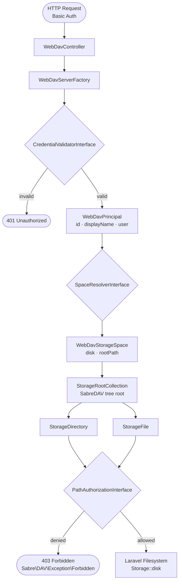

# Architecture

Every WebDAV request passes through this pipeline:

All extension points use `bindIf()` – bind your own implementation in `AppServiceProvider::register()` and it takes
precedence automatically.

