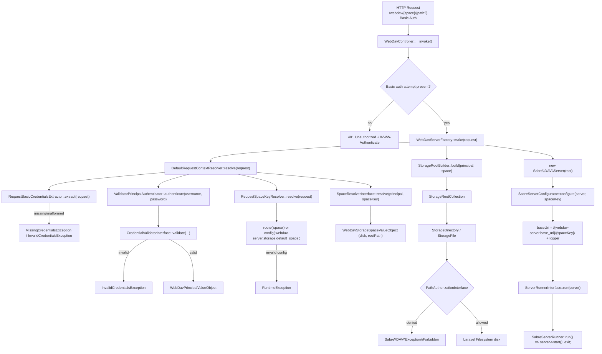

# Architecture

Every WebDAV request passes through this runtime flow:

All extension points are bound via `bindIf()` in `WebdavServerServiceProvider`, so app-level bindings can override defaults.

Related decisions:

- [ADR 0001: Test Architecture And Layering](adr/0001-test-architecture-and-layering.md)
- [ADR 0002: WebDAV Request Pipeline And Runtime Boundary](adr/0002-webdav-request-pipeline-and-runtime-boundary.md)
- [ADR 0005: WebDAV Space Key And Storage Space Mapping](adr/0005-webdav-space-key-and-storage-space-mapping.md)

## Runtime Notes (Current State)

- Route shape is `'/webdav/{space}/{path?}'` in `routes/web.php`.
- `spaceKey` is resolved from the `{space}` route parameter via `RequestSpaceKeyResolver`; falls back to `config('webdav-server.storage.default_space', 'default')` if the parameter is absent.
- Auth-related extractor/authenticator failures throw domain exceptions:
  - `MissingCredentialsException`
  - `InvalidCredentialsException`
- Controller runtime execution is delegated via `ServerRunnerInterface`.
- Default runner is `SabreServerRunner`, which starts SabreDAV and terminates the request lifecycle.
- CSRF bypass is registered in `WebdavServerServiceProvider::registerCsrfException()`.
- CSRF middleware resolution is version-tolerant:
  - `Illuminate\Foundation\Http\Middleware\PreventRequestForgery` (Laravel 13+)
  - fallback: `Illuminate\Foundation\Http\Middleware\VerifyCsrfToken` (Laravel 12)
- CSRF route prefix comes from `config('webdav-server.route_prefix')` and falls back to `config('webdav-server.base_uri')`.
- Base URI for SabreDAV is configured in `SabreServerConfigurator` via `config('webdav-server.base_uri', '/webdav/')`.
