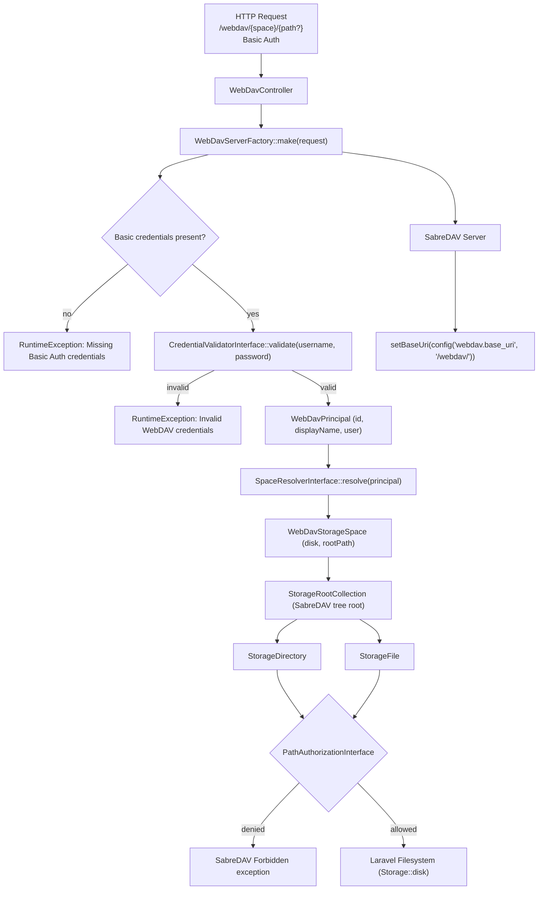

# Architecture

Every WebDAV request passes through this runtime flow:

All extension points use `bindIf()` – bind your own implementation in `AppServiceProvider::register()` and it takes
precedence automatically.

## Runtime Notes (Current State)

- CSRF bypass is registered in `WebdavServerServiceProvider::registerCsrfException()`.
- Middleware resolution is version-tolerant: `PreventRequestForgery` (Laravel 13+) with fallback to
  `VerifyCsrfToken` (Laravel 12).
- CSRF route prefix comes from `webdav.route_prefix` and falls back to `webdav.base_uri`.
- Route shape includes `{space}` (`routes/web.php`), but the current factory call resolves storage via
  `SpaceResolverInterface::resolve($principal)` without passing the route space parameter.

